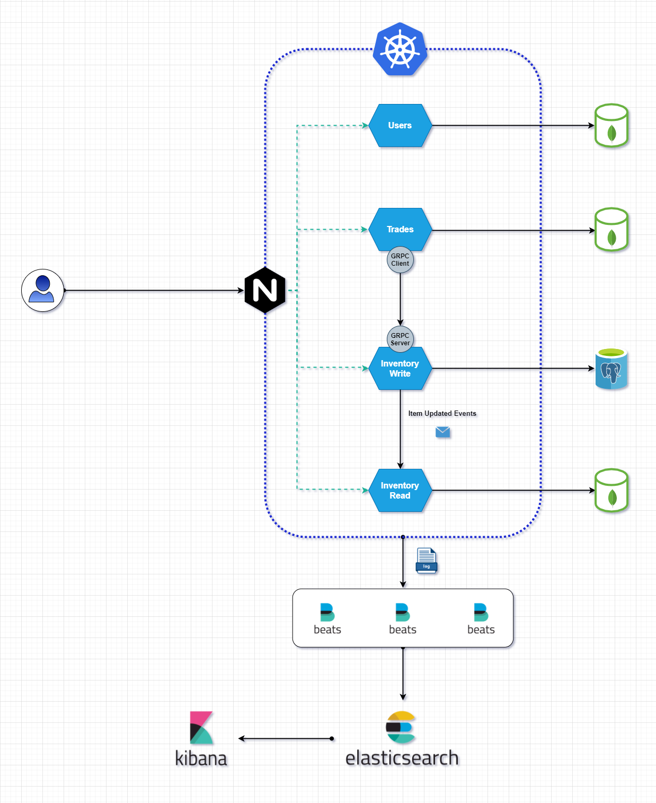

# Tradew Trades

## Overview
The `trades` microservice is responsible for controlling the trades and calling `inventory-write` microsevice to perform the items swap

## Usage

### HTTP
To start the http server on port `9003` run the command:
```
go run main.go api
```


## Docker

You can also run using docker, go in the root of the workspace and run:
```
docker build . -t trades
docker run trades -p 9003:9003
```

## Protobuf
Install [protoc](https://grpc.io/docs/protoc-installation/) and then run the command to generate the pb files
```
protoc --go_out=. --go-grpc_out=. pkg/trades/external/inventory/proto/service.proto
```


## Architecture overview

